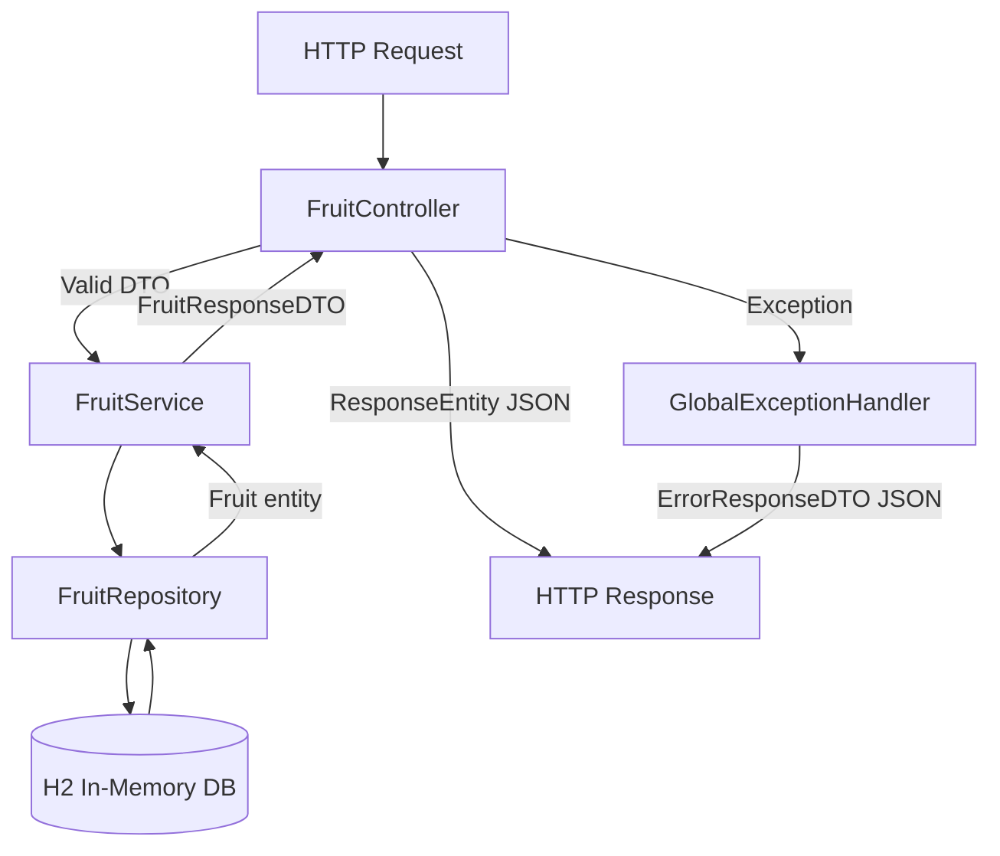
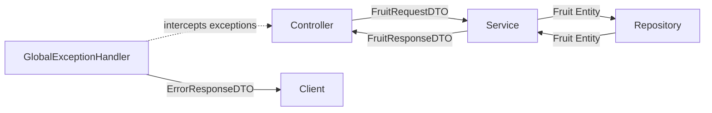

<div align="center">

# 🍓 Fruit API - H2

**Developed by:**
[Federico Cantore](https://github.com/FedEx8525)

*(IT Academy Java Bootcamp - Sprint 4 · Task 2 · Level 1)*

---


</div>

---

## 📖 Description

**Fruit API** is a RESTful backend application built with **Spring Boot** for managing a fruit shop's stock inventory. It allows creating, reading, updating and deleting fruit entries, each with a name and weight in kilos.

The project follows **MVC architecture**, applies the **DTO pattern** to protect internal entities, handles exceptions globally via a `GlobalExceptionHandler`, and is fully tested using **TDD** (Test-Driven Development).

---

## 🏗️ Project Architecture

The application is structured following a strict separation of concerns across layers:

```
fruit-api-h2
├── src
│   ├── main
│   │   ├── java
│   │   │   └── cat.itacademy.s04.t02.n01.fruit
│   │   │       ├── controllers        ← HTTP layer (FruitController)
│   │   │       ├── services           ← Business logic (FruitService, FruitServiceImpl)
│   │   │       ├── repository         ← Data access (FruitRepository)
│   │   │       ├── model
│   │   │       │   ├── Fruit.java     ← JPA Entity
│   │   │       │   └── dto            ← FruitRequestDTO, FruitResponseDTO, FruitUpdateDTO
│   │   │       ├── mapper             ← FruitMapper (Entity ↔ DTO)
│   │   │       └── exception          ← FruitNotFoundException, GlobalExceptionHandler, ErrorResponseDTO
│   │   └── resources
│   │       └── application.properties
│   └── test
│       └── cat.itacademy.s04.t02.n01.fruit
│           ├── controllers            ← FruitControllerTest (MockMvc)
│           ├── services               ← FruitServiceImplTest (Mockito)
│           └── FruitIntegrationTest   ← Full flow tests (SpringBootTest)
├── postman                            ← FruitAPI-H2.postman_collection.json (Postman endpoint test)
│   
├── Dockerfile
├── pom.xml
└── README.md
```

---

## 🔄 Request Flow Diagram



---

## 🔄 Layer Responsibilities



---

## 🛠️ Technologies

| Technology | Version | Purpose |
|:-----------|:--------|:--------|
| **Java** | 21 LTS | Main language |
| **Spring Boot** | 3.x | Application framework |
| **Spring Data JPA** | - | ORM / persistence layer |
| **H2 Database** | - | In-memory SQL database |
| **Spring Validation** | - | Bean Validation (@Valid) |
| **JUnit 5** | - | Test framework |
| **Mockito** | - | Mocking for unit tests |
| **Maven** | - | Build & dependency management |
| **Docker** | - | Containerization |
| **IntelliJ IDEA** | - | IDE |

---

## 📋 Endpoints

Base URL: `http://localhost:8080`

| Method | Endpoint | Description | Request Body | Response |
|:-------|:---------|:------------|:-------------|:---------|
| `POST` | `/fruits` | Create a new fruit | `FruitRequestDTO` | `201 Created` |
| `GET` | `/fruits` | Get all fruits | - | `200 OK` |
| `GET` | `/fruits/{id}` | Get fruit by ID | - | `200 OK` / `404 Not Found` |
| `PUT` | `/fruits/{id}` | Update fruit by ID | `FruitUpdateDTO` | `200 OK` / `404 Not Found` |
| `DELETE` | `/fruits/{id}` | Delete fruit by ID | - | `204 No Content` / `404 Not Found` |

### Request & Response Examples

**POST /fruits**
```json
// Request body
{
  "name": "apple",
  "weightInKilos": 10
}

// Response 201
{
  "id": 1,
  "name": "apple",
  "weightInKilos": 10
}
```

**PUT /fruits/1**
```json
// Request body
{
  "name": "mango",
  "weightInKilos": 50
}

// Response 200
{
  "id": 1,
  "name": "mango",
  "weightInKilos": 50
}
```

**Error Response (404 / 400 / 500)**
```json
{
  "timestamp": "2026-03-11T10:30:00",
  "status": 404,
  "error": "Not Found",
  "message": "Fruit not found with id: 99"
}
```

---

## ⚙️ Configuration

The application uses **environment variables** with default fallback values for local development:

| Variable | Default Value | Description |
|:---------|:-------------|:------------|
| `DB_URL` | `jdbc:h2:mem:fruitdb` | Database connection URL |
| `DB_USERNAME` | `sa` | Database username |
| `DB_PASSWORD` | *(empty)* | Database password |

In production, set these variables in your environment or Docker run command.

---

## 🚦 Getting Started

### Prerequisites
- Java 21
- Maven 3.x
- Docker (optional)

### Run locally

**1. Clone the repository:**
```bash
git clone https://github.com/FedEx8525/4.2-API-REST-With-SpringBoot.git
cd Level1/fruit-api-h2
```

**2. Build and run:**
```bash
./mvnw spring-boot:run
```

**3. Access the H2 console (development only):**
```
http://localhost:8080/h2-console
JDBC URL: jdbc:h2:mem:fruitdb
Username: sa
Password: (empty)
```

---

### Run with Docker

**1. Build the Docker image:**
```bash
docker build -t fruit-api-h2 .
```

**2. Run the container:**
```bash
docker run -p 8080:8080 fruit-api-h2
```

**3. Run with custom environment variables (production):**
```bash
docker run -p 8080:8080 \
  -e DB_URL=jdbc:mysql://your-db:3306/fruitdb \
  -e DB_USERNAME=youruser \
  -e DB_PASSWORD=yourpassword \
  fruit-api-h2
```

---

## 🧪 Testing Strategy

The project follows **TDD (Test-Driven Development)** with three levels of testing:

| Test Class | Type | Tool | What it tests |
|:-----------|:-----|:-----|:--------------|
| `FruitServiceImplTest` | Unit | Mockito | Service logic in isolation |
| `FruitControllerTest` | Unit | MockMvc + Mockito | HTTP layer in isolation |
| `FruitIntegrationTest` | Integration | SpringBootTest | Full request flow with real H2 |

**Run all tests:**
```bash
./mvnw test
```
**Test coverage includes:**
- Happy path for all CRUD operations
- 404 Not Found when ID does not exist
- 400 Bad Request when input data is invalid
- Full create → read → update → delete flow (integration)

## 🔧 Manual Testing with Postman

A Postman collection is available in the `/postman` folder.

**Import the collection:**
1. Open Postman → **Import** → select `FruitAPI-H2.postman_collection.json`
2. Activate the `Fruit API local` environment (top right dropdown)
3. Start the application locally
4. Run the requests

**Collection structure:**
| Folder | Requests |
|:-------|:---------|
| ✅ Happy Path | Create, Get All, Get By ID, Update, Delete |
| ❌ Error Cases | 404 Not Found (x3), 400 Bad Request (x3) |

**Recommended test flow:**
```bash
POST  /fruits       → create a fruit, note the returned id
GET   /fruits       → verify it appears in the list
GET   /fruits/{id}  → verify by id
PUT   /fruits/{id}  → update and verify the change
DELETE /fruits/{id} → delete
GET   /fruits/{id}  → should return 404 ✅
```
